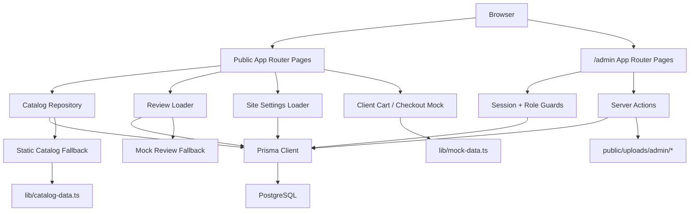

# Project Health Report

Date: 2026-06-27
Repository: `Vedma`
Audited branch: `codex/package-2-admin-panel`
Reference branches: `main`, `codex/cms-foundation-migration`
Audit mode: implementation-first branch stabilization snapshot

## Executive Summary

The repository is no longer in the pre-admin state described by older audit notes. On the current branch, Package 2 is implemented as a real DB-backed admin panel with authentication, roles, CRUD for core CMS entities, media management, and site settings integration into the public website.

The current source of truth is split across two Git states:

- `main` contains Package 1 and Package 1.1 only.
- `codex/package-2-admin-panel` contains Package 2 and its Package 2.1 stabilization closeout.

The project is now a hybrid production candidate:

- Catalog and settings are live through Prisma-aware loaders.
- Admin authentication and core CMS operations are real.
- Checkout, orders, requests, and payments are still not operational.
- Public content is partially DB-backed and partially static/mock.
- Admin-branch stabilization is complete enough for merge.

## Current Git State

### Branches

- Current branch: `codex/package-2-admin-panel`
- `main` head: `0e5dae5` (`Merge CMS foundation and catalog migration`)
- Current branch head: `c5f04d3` (`Package 2 – Production CMS Admin Panel`)

### Merged Timeline

1. `d50222a` Rebalanced the site around the Bazhena personal-brand direction.
2. `5987216` added the Prisma/PostgreSQL foundation and catalog migration.
3. `38c693a` verified Package 1 against a real local PostgreSQL instance.
4. `0e5dae5` merged Package 1 / 1.1 work into `main`.
5. `c5f04d3` added Package 2 on the current feature branch.

### Tags

- No Git tags are present.

### Working Tree Status

Relevant tracked files pending closeout commit:

- `app/admin/actions.ts`
- `app/admin/(panel)/users/[id]/page.tsx`
- `lib/admin/media.ts`
- `next.config.mjs`
- `docs/migration/package-1-import-report.md`
- `docs/migration/package-1-verification-report.md`

Important untracked local-only paths:

- `.env`
- `.tmp/`
- `docs/admin/screenshots/`
- `public/uploads/admin/`
- `docs/audit/project-status.md`
- `docs/audit/repository-audit.md`
- `docs/audit/technical-debt.md`

### Meaning Of Current Dirty State

The remaining tracked changes are not random drift. They are the intentional Package 2.1 closeout set:

- admin media upload validation raised from `5 MB` to `10 MB`
- `experimental.serverActions.bodySizeLimit` raised to `12mb`
- media server actions now redirect with user-facing errors instead of failing noisily
- user deletion was added to the admin user detail page
- Package 1 verification docs were regenerated after cleaning temporary smoke data and now report the expected baseline counts again

The untracked files are local artifacts and should remain out of Git.

## Package Audit

### Package 1

Status: `DONE`

Explanation:

- Prisma schema, initial migration, seed, import, verification, repository layer, and DB-backed public catalog integration all exist.
- The work was merged into `main`.

### Package 1.1

Status: `DONE`

Explanation:

- `docs/migration/package-1-db-smoke-test.md` records a successful real PostgreSQL validation run on 2026-06-25.
- The verification commit `38c693a` exists in Git history and is merged into `main`.

### Package 2

Status: `DONE`

Explanation:

- The current branch contains a real `/admin` system, DB sessions, role checks, CRUD for products/services/reviews/users, media management, settings management, and public revalidation.
- This work is committed at `c5f04d3`.
- It is complete on the current branch even though it is not merged into `main`.

### Package 2.1

Status: `DONE`

Explanation:

- Real database setup, import state, verification, and production build have now been rechecked against PostgreSQL.
- The acceptance work produced targeted fixes for media uploads, server-action limits, media error handling, and temporary-user cleanup.
- The exploratory monolithic smoke script remains an untracked local artifact, but the branch-closeout checks now pass and the branch is ready to merge.

## Current Architecture

### Runtime Shape

### Frontend

- Framework: Next.js `15.3.4`
- Router: App Router
- Rendering style: server-rendered route segments with client components for cart, header behaviors, dirty-form prompts, and admin buttons
- Styling: route-level CSS in `app/globals.css` and `app/admin/admin.css`

### Backend

- No `app/api/*` route handlers
- Server-side mutations are implemented with server actions in `app/admin/actions.ts`
- Authentication is cookie + Prisma session based

### Repository Layer

- `lib/catalog/repository.ts` is the main read path for products/services
- It prefers Prisma reads and falls back to `lib/catalog/fallback.ts`
- Mapping preserves legacy presentation fields such as `subtitle`, `details`, `badge`, `accent`, and `icon`

### Prisma / Database

- Prisma provider: PostgreSQL
- Models: `User`, `Session`, `Product`, `Service`, `Media`, `Order`, `Request`, `Payment`, `Review`, `SiteSetting`
- Migrations:
  - `20260625122538_package_1_init`
  - `20260627120000_package_2_admin_auth`

## Database Audit

### Operational Status

Status: operational for the implemented CMS/catalog flows

Evidence in repository:

- Prisma client is configured and used broadly
- import and verification scripts exist and were previously executed successfully
- Package 2.1 notes indicate a later real-DB run also succeeded for migrate/seed/import/build

### Tables Actively Used In Runtime Code

- `Product`
- `Service`
- `Media`
- `User`
- `Session`
- `Review`
- `SiteSetting`

### Tables Present But Not Operationally Implemented

- `Order`
- `Request`
- `Payment`

These appear in the dashboard as counts only. There is no create flow, admin queue, public submission pipeline, or payment integration using them.

### Placeholder / Dead Model Assessment

- No Prisma model is fully dead yet because all can plausibly support later packages.
- `Order`, `Request`, and `Payment` are placeholders in runtime terms.
- `CUSTOMER` in the `Role` enum is currently unused by any auth flow or UI.

## Admin Panel Audit

### Status

Real and functional for core CMS operations, accepted for Package 2 scope

### Implemented Modules

- login/logout
- session handling
- role enforcement for `ADMIN` and `MANAGER`
- dashboard
- product CRUD
- service CRUD
- media library
- review CRUD
- site settings editor
- admin user management

### Missing Modules

- orders
- requests / leads
- payments
- customer accounts
- audit log / activity history
- bulk media relation management beyond path selection

### CRUD Completeness

- Products: strong CRUD with search, sort, filter, pagination, bulk status changes, preview, delete
- Services: strong CRUD matching products
- Reviews: basic CRUD, no pagination, no workflow moderation
- Media: upload, replace, alt/source edit, protected delete
- Users: create, edit, deactivate, password reset, delete
- Settings: single-record settings form, admin-only

### Authentication / Roles

- Password hashing: Node `scrypt`
- Session store: Prisma `Session`
- Cookie: `vedma_admin_session`
- `ADMIN`: full admin access
- `MANAGER`: catalog/media/reviews access only

### Broken Or Fragile Areas

- Media upload acceptance needed post-commit fixes for large uploads and better error handling
- User deletion exists only in the uncommitted Package 2.1 worktree
- No CSRF-specific hardening beyond same-site cookies and server actions
- No audit trail for destructive admin actions

## Public Website Audit

### Production-Ready Or Near-Ready Pages

- `/products`
- `/products/[slug]`
- `/services`
- `/services/[slug]`
- `/contacts`
- `/legal`

These are live in the sense that they render from the current architecture without preview-only placeholders, though some text still comes from defaults or mock-derived content.

### Partially Production-Ready Pages

- `/`
  - live catalog, reviews loader, and settings-backed hero/footer
  - still uses static `benefits` and `processSteps`
- `/reviews`
  - reads DB reviews when available
  - falls back to mock reviews when DB is absent or empty
- `/about`
  - still static/mock-authored copy and portrait asset

### Not Production-Ready Business Flows

- `/checkout`
  - visual flow only
  - no persistence
  - no request/order creation
- client cart
  - built from `lib/mock-data.ts`
  - not repository-backed

### SEO

- root metadata is settings-backed
- product/service detail metadata is generated dynamically
- page-level metadata exists for key public pages
- no advanced SEO system, sitemap logic, structured data, or admin SEO preview

## Content Audit

### Content Sources By Domain

- Products:
  - runtime source: Prisma `Product` through `lib/catalog/repository.ts`
  - fallback source: `lib/catalog-data.ts`
- Services:
  - runtime source: Prisma `Service`
  - fallback source: `lib/catalog-data.ts`
- Images:
  - imported source: preserved files in `public/uploads/vk/*`
  - admin uploads: `public/uploads/admin/*`
  - metadata: Prisma `Media`
- Reviews:
  - runtime source: Prisma `Review`
  - fallback source: `lib/mock-data.ts`
- Categories:
  - derived from catalog data and helper mappings, not first-class CMS tables
- Settings:
  - runtime source: Prisma `SiteSetting`
  - fallback/default source: `DEFAULT_SITE_SETTINGS` in `lib/admin/settings.ts`
- Homepage marketing copy:
  - hero/footer/contacts/legal: settings-backed
  - benefits/process/about directions: static mock data

## Documentation Mismatches

The older audit docs in `docs/audit/` are no longer accurate for this branch.

Major mismatches:

- they describe the repo as Package 1 only
- they describe admin as preview-only
- they describe `/admin/*` as absent
- they describe reviews as hardcoded only
- they describe settings as not operational
- they describe `PROJECT_STATE.md` as if it existed, but the file is absent in the repo before this audit

Documents that do match current branch reality more closely:

- `README.md`
- `docs/admin/admin-architecture.md`
- `docs/admin/admin-user-guide.md`
- `docs/admin/package-2-summary.md`

Documents that are historically valid but no longer current-state summaries:

- `docs/audit/project-status.md`
- `docs/audit/repository-audit.md`
- `docs/audit/technical-debt.md`

## Technical Debt

### Architecture Debt

- catalog read path is hybrid DB + static fallback
- reviews are DB-backed but still fall back to mock data
- client cart and checkout still depend on `lib/mock-data.ts`
- category semantics are helper-derived rather than modeled cleanly

### Product Debt

- no order capture
- no request/lead capture
- no payment pipeline
- no delivery or fulfillment flows
- no customer account runtime

### Admin Debt

- no order/request/payment modules
- no audit logging
- no file deduplication or true reusable many-to-many media model
- no workflow status system for reviews or content approval

### Code Debt

- preview routes remain in repo: `/admin-preview`, `/account-preview`
- older audit docs are stale and misleading
- Package 2.1 acceptance fixes remain uncommitted
- generated Package 1 verification docs currently reflect a dirty smoke-test database rather than the clean imported baseline

### Tooling Debt

- no dedicated typecheck script
- no test suite
- no CI configuration in the repo
- no production deployment or environment documentation beyond local setup
- local build behavior depends on whether the PostgreSQL instance referenced by `.env` is running

## Project Maturity Scores

- Architecture: `7/10`
- Code quality: `7/10`
- Maintainability: `6/10`
- Scalability: `6/10`
- Developer experience: `6/10`
- Security: `5/10`
- Admin readiness: `7/10`
- Commerce readiness: `3/10`
- Production readiness: `5/10`

## Immediate Blockers

- checkout is still non-operational
- order/request/payment flows are schema-only
- stale audit docs can mislead future package planning

## Recommended Next Package

### Package 3 — Commerce And Intake Backbone

Goal:

- turn the visual checkout into a real intake pipeline backed by Prisma

Dependencies:

- Package 2 admin branch stabilized
- Package 2.1 acceptance completed

Risks:

- current mock cart IDs and repository IDs must stay aligned during migration
- unclear business rules for orders versus requests could create duplicate flows

Acceptance criteria:

- checkout writes `Order` and/or `Request`
- admin can view and update new submissions
- cart resolves from repository-backed items instead of mock arrays
- public success/failure handling exists

Expected deliverables:

- real checkout submission flow
- admin orders/requests modules
- shared intake/domain decisions

## Long-Term Roadmap

### Package 3 — Commerce And Intake Backbone

- real checkout persistence
- order/request admin modules
- repository-backed cart

### Package 4 — Payments, Fulfillment, And Operational Backoffice

- payment integration or manual payment workflow
- payment tracking
- fulfillment and delivery statuses

### Package 5 — Content Hardening And Fallback Retirement

- move remaining static marketing content into CMS-managed settings/content models
- reduce or retire static catalog fallback where safe
- clean category/content modeling

### Package 6 — Customer Area And Trust Infrastructure

- customer auth
- order/request history
- account flows
- stronger security and audit logging

## Estimated Remaining Packages

- Approximately `4` large packages remain after Package 2:
  - commerce backbone
  - operational backoffice
  - content hardening
  - customer/account + trust infrastructure

## Highest Risks

1. Branch reality and documentation reality are out of sync, which can send future work down the wrong path.
2. Commerce schema exists without runtime flows, which can create false confidence about production readiness.
3. Hybrid fallback behavior can mask database issues and delay discovery of broken production assumptions.
4. Client cart still depends on static mock data, which will become a sharp edge once real order flows begin.
5. Local artifact sprawl (`.tmp`, screenshots, uploads, ad hoc scripts) can confuse future stabilization work if not kept out of commits.

## Validation Snapshot

- `pnpm lint`: passed on 2026-06-27 after ignoring generated `.next` output and scratch `.tmp` files
- `pnpm build`: passed on 2026-06-27 against the real local PostgreSQL instance configured in `.env`
- `pnpm db:verify:catalog`: passed on 2026-06-27 with expected counts `71` products, `2` services, `73` media

## Merge Readiness

Status: `READY TO MERGE`

Why:

- Package 2 code is already committed on the branch
- Package 2.1 stabilization fixes are identified and scoped
- lint passes
- DB-backed production build passes
- catalog verification passes
- docs now describe the actual branch state and intended DB/fallback behavior
