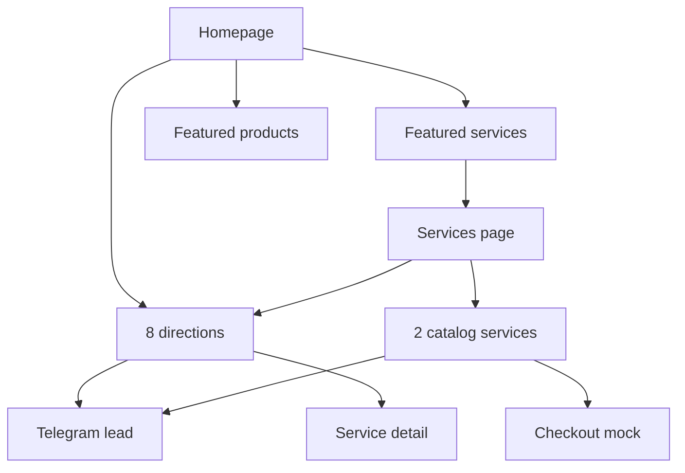

# UX Audit — Bazhena / Vedma

**Date:** 2026-06-24

## Before recovery

| Area | Severity | Issue |
|------|----------|-------|
| Information hierarchy | High | 71 products vs 2 services made site feel like a shop |
| Services page | High | Two cards in large grid — visually empty |
| Homepage hero | Medium | CSS-only decorative block, no real imagery |
| Homepage length | Medium | 11 sections including legal blocks — template fatigue |
| Catalog filters | Medium | Format chips looked clickable but did nothing |
| Service cards | Medium | «В корзину» inappropriate for booking-style services |
| Process section | Low | Placeholder text undermined trust |
| Copy tone | Low | «Визуальный прототип» in title, footer, legal notice |

## After recovery

| Area | Fix | Status |
|------|-----|--------|
| Services page | 8 direction cards + 2 catalog services + lead CTA | Done |
| Homepage order | Services-first narrative, legal section removed | Done |
| Hero | Real VK image, trust pills retained | Done |
| Directions | Reusable grid on home + services | Done |
| Popular products | Diverse category picker (6 items) | Done |
| Visual gallery | 8 imported images on homepage | Done |
| Product catalog | Russian semantic categories + nav row | Done |
| Service CTA | «Записаться» → Telegram with prefilled text | Done |
| Empty state | Catalog search/filter shows message | Done |
| Process steps | Real copy, numbered cards | Done |
| Prototype language | Removed from layout, footer, legal notice | Done |
| Detail pages | Russian category labels, cleaner related copy | Done |

## Remaining limitations (by design)

- Only 2 services have prices in VK catalog; other directions lead to Telegram
- Cart/checkout remain client-side mock (no backend)
- Related products on detail pages are first siblings, not category-based
- No Bazhena personal photo in repo — service/altar VK image used as portrait

## Conversion path (after)

## Key pages reviewed

- `/` — hero, directions, featured blocks, gallery, benefits, process, reviews, CTA
- `/services` — directions grid, catalog services, lead CTA
- `/products` — category nav, semantic filters
- `/about` — portrait image, directions, benefits
- `/services/[slug]`, `/products/[slug]` — metadata, Russian labels
